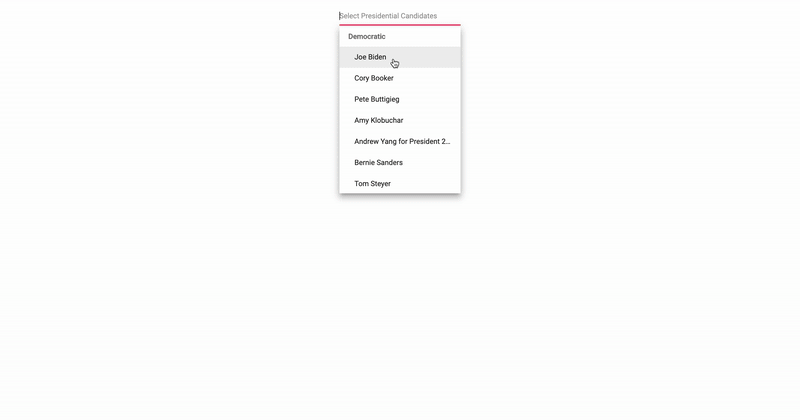

# 📊 Digital Ad Spending Visualation for Presidential Candidates

> ## Play around with the visualization [here!](https://regional-ad-spending.web.app/spending)

This project was developed to help visualize presidential candidates digital ad spending. I created it for the Delta Lab at Wesleyan University from data collected by Professor Pavel from the Quantitative Analysis Center. 

# Things I learned
- Learned to use Javascript's equivilent of Pandas called DataframeJS
- Learned to incorporate Google Charts to plot dynamic data on a map
- Animate features to add a playful touch to it
- Learned to use a basic slider element by Syncfusion and use it to create a dynamic timeline

# Features
- Dynamic timeline (Ability to expand and slide the timeline as the user pleases)
- Check out one candidate or compare two candidates data side to side
- Mobile Friendly 
- Total spending for the time period as well as highest state data
- Dynamic max-range depending upon chosen candidates

> For a closer look, see [here!](https://regional-ad-spending.web.app/spending)
>> 

## Development server

Run `ng serve` for a dev server. Navigate to `http://localhost:4200/`. The app will automatically reload if you change any of the source files.
